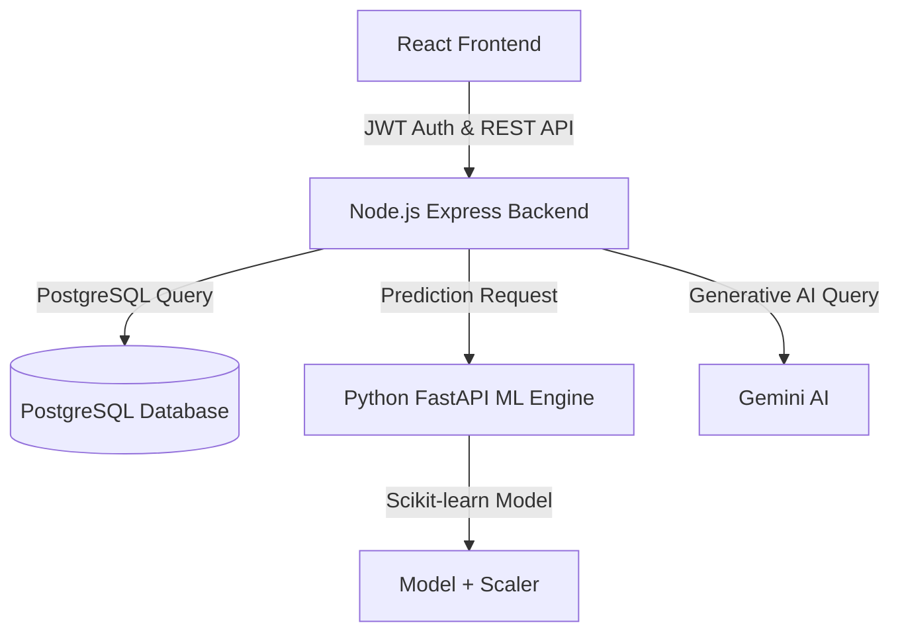

# EDU-Vantage-AI — Manual Testing Project

## Project Overview

**EDU-Vantage-AI** is an AI-based student academic performance prediction system.

This repository documents the manual testing performed for the application, including functional, integration, security/RBAC, ML output validation, UI/UX and responsive testing.

## Testing Scope

- Manual Functional Testing
- Integration Testing
- Regression Testing
- Negative Testing
- Boundary Value Testing
- ML Model Output Validation
- Role-Based Access Control (RBAC)
- Basic Security Testing
- UI/UX Testing
- Responsive Testing

## Application Architecture



## Modules Tested

1. Authentication & Authorization
2. Academic Performance Form
3. Standalone GPA Predictor
4. Student Dashboard
5. Teacher/Admin Panel
6. CGPA Recommendations & Roadmaps
7. EduBot AI Chatbot
8. RBAC & Security
9. UI/UX & Responsiveness

## Test Results

| Metric | Result |
|---|---:|
| Test Scenarios | 11 |
| Test Cases Executed | 38 |
| Passed | 38 |
| Failed | 0 |
| Defects Identified & Fixed | 7 |
| Test Pass Rate | 100% |

## Defect Summary

Seven defects were identified, fixed and regression tested:

- BUG-01 — ML attendance scaling issue
- BUG-02 — Parent support validation issue
- BUG-03 — Backend attendance double-scaling
- BUG-04 — Academic record SQL insertion issue
- BUG-05 — Student/dashboard SQL query issue
- BUG-06 — Authentication middleware response-header issue
- BUG-07 — Prediction controller function export/import mismatch

## Repository Structure

```text
EDU-Vantage-AI-Manual-Testing/
│
├── README.md
├── Test-Plan/
│   └── EDU-Vantage-Test-Plan.md
├── Test-Cases/
│   └── EDU-Vantage-Test-Cases.md
├── Bug-Reports/
│   ├── BUG-001.md
│   ├── BUG-002.md
│   ├── BUG-003.md
│   ├── BUG-004.md
│   ├── BUG-005.md
│   ├── BUG-006.md
│   └── BUG-007.md
├── Test-Execution/
│   └── Test-Execution-Report.md
├── Screenshots/
│   ├── Login/
│   ├── Dashboard/
│   ├── Prediction/
│   ├── Admin/
│   └── Chatbot/
└── Test-Summary/
    └── Final-Test-Summary.md
```

## Testing Approach

The application was tested module-by-module. Positive, negative and boundary-value scenarios were executed, followed by regression testing after defects were fixed.

## Tools

- Browser Developer Tools
- Chrome / Edge
- Postman (for API validation where applicable)
- PostgreSQL/database validation
- Git & GitHub
- Manual test documentation

## Note

Screenshots/evidence can be added under the `Screenshots/` folders for individual executed test cases and defects.
